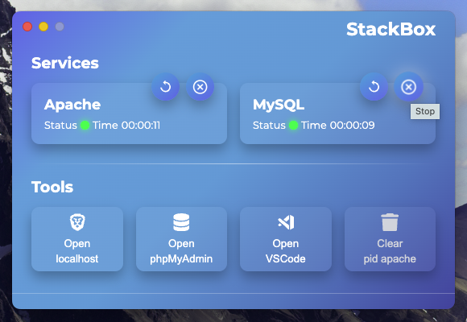

<div align="center">
  <a href="https://frakto.dev/">
    
  </a>
  <br>
  
  
  
  
  
  
</div>

# StackBox

Local control panel for macOS inspired by XAMPP, designed for developers who prefer a fast, straightforward, and elegant interface to manage services like **Apache** and **MySQL**, plus access to tools like **localhost**, **phpMyAdmin**, and other utilities.

---

## Table of Contents

- [Features](#features)
- [Requirements](#requirements)
- [Recommended Apache Config](#recommended-apache-config)
- [Logs](#logs)
- [Language support](#language-support)
- [Install & Run](#install--run)
- [Contributing](#contributing)
- [License](#license)
- [Support this project](#support-this-project)

## Features

- Start, stop, and restart local Apache and MySQL services.
- Quick access to:
  - `log files` (opens in System Editor).
  - `localhost` (opens in Brave).
  - `phpMyAdmin` (opens in Brave).
  - Delete the `httpd.pid` file. (One-click delete of Apache PID file when needed, useful if Apache won’t start.)
  - **Vs Code** app.
- Real-time monitoring of service status.
- Minimalist interface optimized for macOS (`vibrancy`, `hiddenInset`, no annoying buttons).
- Automatically stops all services when you close the app (`⌘ + Q` or `⌘ + W`).
- Built with **Electron** + ❤️.

---

## Requirements

- macOS 12+
- Node.js 18+
- Brave Browser installed (`/Applications/Brave Browser.app`)
- VS Code installed (`/Applications/Visual Studio Code.app`)
- Apache and MySQL managed via Homebrew

---

## Recommended Apache Config

To run Apache on ports `80` and `443` **without requiring sudo each time**, ensure your `httpd.conf` includes:

```apache
User <user>
Group <group>
```

And your `Listen` directives:

```apache
Listen 80
Listen 443
```

Adjust `User` and `Group` to match your local user.

---

## Logs

Access log:

```
/opt/homebrew/var/log/httpd/access_log
```

Apache error log:

```
/opt/homebrew/var/log/httpd/error_log
```

MySQL error log:

```
/opt/homebrew/var/mysql/<username>.err
```

---

### Change Apache and MySQL log paths

To change Apache logs, edit `httpd.conf`:

```apache
ErrorLog "/opt/homebrew/var/log/httpd/error_log"
CustomLog "/opt/homebrew/var/log/httpd/access_log" common
```

Replace with your custom paths:

```apache
ErrorLog "/Users/<username>/logs/apache_error.log"
CustomLog "/Users/<username>/logs/apache_access.log" common
```

To change the MySQL error log, edit `my.cnf`:

```ini
[mysqld]
log-error=/Users/<username>/logs/mysql_error.log
```

You can adjust these log paths in the IPC handlers located in your `js/main.js` under **`// IPC handlers for logs`**.

---

## Language support

StackBox auto-detects your system language and switches to `en` (English) or `es` (Spanish) automatically.

To add another language, copy the `locales/en.json` file, rename it using only the **base language code** (like `fr.json`, `de.json`, `ru.json`) and translate the keys.

Keep the structure identical to `en.json`.  
On startup, if the detected language matches your file, it will be used automatically.

---

## Install & Run

1. Clone the repository:

   ```bash
   git clone https://github.com/danybranding/stackbox.git
   cd stackbox
   ```

2. Install dependencies:

   ```bash
   npm install
   ```

3. Start in development:

   ```bash
   npm start
   ```

4. Build for macOS:

   ```bash
   npm run build
   ```

## Contributing

Open PRs and issues are welcome.  
Please keep the code style consistent and follow the existing patterns.

## License

MIT License — Copyright © 2025 [DΔNNY BS](https://github.com/danybranding/)

## Support this project

If StackBox helps your local workflow, please **star this repo** on GitHub — it keeps the project visible and alive!

[](https://coff.ee/danybranding)

**Happy local development!**
